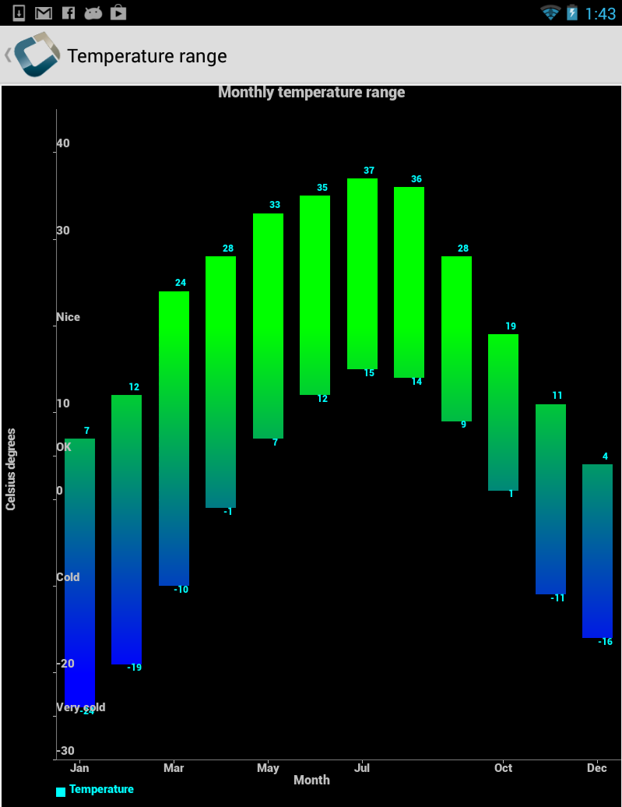
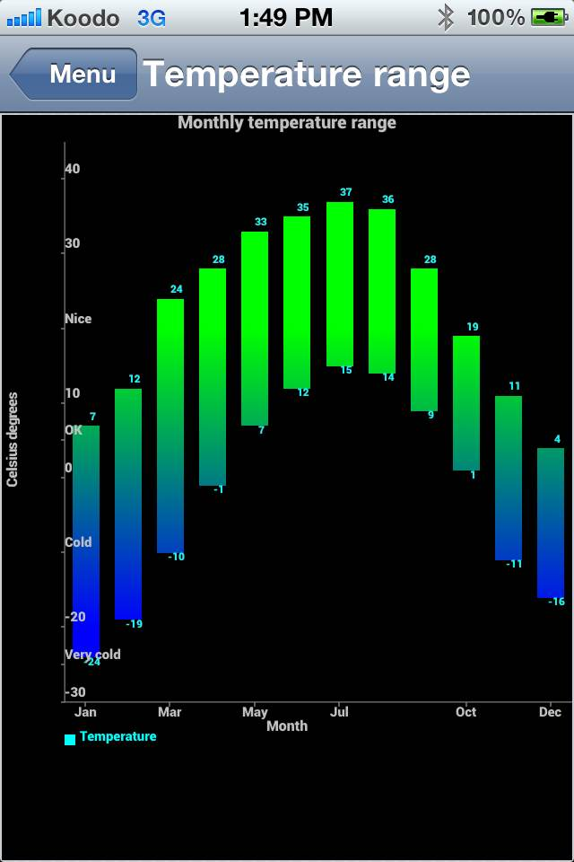

#A Chart Engine for Codename One

This is a port of the fantastic android [achartengine](https://code.google.com/p/achartengine/) for [Codename One](http://www.codenameone.com).

##Synopsis
From the achartengine google page:

AChartEngine is a charting library for Android applications. It currently supports the following chart types:

* line chart
* area chart
* scatter chart
* time chart
* bar chart
* pie chart
* bubble chart
* doughnut chart
* range (high-low) bar chart
* dial chart / gauge
* combined (any combination of line, cubic line, scatter, bar, range bar, bubble) chart
* cubic line chart

All the above supported chart types can contain multiple series, can be displayed with the X axis horizontally (default) or vertically and support many other custom features. The charts can be built as a view that can be added to a view group or as an intent, such as it can be used to start an activity.
The model and the graphing code is well optimized such as it can handle and display huge number of values.

Read a short introduction to AChartEngine [here](http://www.javaadvent.com/2012/12/achartengine-charting-library-for.html)

Another good tutorial can be read [here](http://jaxenter.com/effort-free-graphs-on-android-with-achartengine-46199.html)

##License

Apache License 2.0

##Project Status

Alpha.

* Currently provides full compatibility for rendering of all charts offered by achartengine.
* Still need to add better support for event handling (pan & zoom).
* Tested so far only on iOS, Android, and the Simulator.  Still need to test on J2ME, RIM, and Windows Phone.  But should work.
* Uses a mixture of the CN1Pisces library and the Codename One Graphics class for 2D drawing.  Periodically running into bugs on various platforms (mainly iOS) with some 2D drawing primitives.

##Dependencies

1. The [CN1Pisces](https://github.com/shannah/CN1Pisces) library.
2. The [CN1FontBox](https://github.com/shannah/CN1FontBox) library.

##Download

* [Latest Release (2.0)](https://github.com/shannah/CN1aChartEngine/releases/latest) - Best option for iOS, Android, & Simulator
* [Version 1.0](https://github.com/shannah/CN1aChartEngine/releases/tag/1.0) - Best option for legacy platforms (J2ME, BlackBerry, Windows Phone), but slower than the latest release.

##Documentation

1. [JavaDocs](https://rawgithub.com/shannah/CN1aChartEngine/master/dist/javadoc/index.html)
2. [CN1aChartEngineDemo](https://github.com/shannah/CN1aChartEngineDemo) - Codename One port of the aChartEngine demo application.  You can view the source to see how all charts were created.  You should be able to build the App also.
3. Original [achartengine](https://code.google.com/p/achartengine/) google code site.

##Demo

Check out the [CN1aChartEngine Demo application](https://github.com/shannah/CN1aChartEngineDemo) for examples of how to use the library.

##Usage

This port was created by adding a compatibility layer upon which achartengine runs.  achartengine's code was left largely intact except in places where it called methods whose classes exist in codename one but don't contain the specified method (e.g. String.split()).  In those cases the code was only changed slightly to call utility functions in the compatibility layer.

Therefore, you should be able to use the API for achartengine exactly it is used in its original Android library form.  All examples and documentation you find in the achartengine site and referencing sites should work pretty much unchanged with the exception that classes in the android.* namespace should be changed to either reference Codename One equivalents or corresponding classes inside the org.achartengine.compat package (i.e. the compatibility layer).

###ChartFactory

The ChartFactory class is a good starting point for getting into making charts.  It provides a facade for creating views of all of the chart types in the library.  It provides two flavours of generator for each chart type:

1. getXXXChartView() - Returns a GraphicalView object which wraps a Codename One Component that renders the chart.  This component can be added anywhere into the Codename One component hierarchy just like any other component like Label and Button.
2. getXXXChartIntent() - Returns an Intent object, which can be used to show a Form containing the chart view.

###Example

~~~~

    double[] minValues = new double[] { -24, -19, -10, -1, 7, 12, 15, 14, 9, 1, -11, -16 };
    double[] maxValues = new double[] { 7, 12, 24, 28, 33, 35, 37, 36, 28, 19, 11, 4 };

    XYMultipleSeriesDataset dataset = new XYMultipleSeriesDataset();
    RangeCategorySeries series = new RangeCategorySeries("Temperature");
    int length = minValues.length;
    for (int k = 0; k < length; k++) {
      series.add(minValues[k], maxValues[k]);
    }
    dataset.addSeries(series.toXYSeries());
    int[] colors = new int[] { Color.CYAN };
    XYMultipleSeriesRenderer renderer = buildBarRenderer(colors);
    setChartSettings(renderer, "Monthly temperature range", "Month", "Celsius degrees", 0.5, 12.5,
        -30, 45, Color.GRAY, Color.LTGRAY);
    renderer.setBarSpacing(0.5);
    renderer.setXLabels(0);
    renderer.setYLabels(10);
    renderer.addXTextLabel(1, "Jan");
    renderer.addXTextLabel(3, "Mar");
    renderer.addXTextLabel(5, "May");
    renderer.addXTextLabel(7, "Jul");
    renderer.addXTextLabel(10, "Oct");
    renderer.addXTextLabel(12, "Dec");
    renderer.addYTextLabel(-25, "Very cold");
    renderer.addYTextLabel(-10, "Cold");
    renderer.addYTextLabel(5, "OK");
    renderer.addYTextLabel(20, "Nice");
    renderer.setMargins(new int[] {30, 70, 10, 0});
    renderer.setYLabelsAlign(Align.RIGHT);
    XYSeriesRenderer r = (XYSeriesRenderer) renderer.getSeriesRendererAt(0);
    r.setDisplayChartValues(true);
    r.setChartValuesTextSize(12);
    r.setChartValuesSpacing(3);
    r.setGradientEnabled(true);
    r.setGradientStart(-20, Color.BLUE);
    r.setGradientStop(20, Color.GREEN);
    Intent intent = ChartFactory.getRangeBarChartIntent(context, dataset, renderer, Type.DEFAULT,
        "Temperature range");
    
    Context context = new Context();
	context.startActivity(intent);

~~~~

Result:

(This screenshot was taken directly from a Nexus 7 Android Device)

Same chart running on iPhone4S:

##Screenshots

##Credits

1. achartengine library created by [4ViewSoft](http://www.4viewsoft.com/)
2. Codename One port for achartengine developed by [Steve Hannah](http://sjhannah.com)

